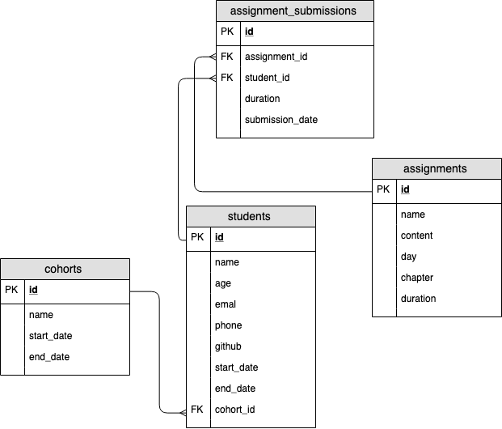

# BootcampX Assignments - Walkthrough

In this exercise, we will add two new tables to our database.

## The Entities
The next entities that we will be adding are assignments and assignment_submissions.

An assignment will have the following attributes:

  * id: A unique identifier
  * name: The name of the assignment
  * content: The written content body of the assignment
  * day: The day that the assignment appears on
  * chapter: The order that the assignment will appear in the day.
  * duration: The average time it takes a student to finish

An assignment_submission will have the following attributes:

  * id: A unique identifier
  * assignment_id: The id of the assignment
  * student_id: The id of the student
  * duration: The time it took the student to complete the assignment
  * submission_date: The date is was submitted

A student will be able to submit an assignment_submissions for every single assignment. So a student will submit many assignment_submissions and an assignment will have many assignment_submissions associated with it.

## ERD MODEL

 

## Tables
Using the ERD, we can create the tables for our assignment and assignment_submission entities. 

Write the CREATE TABLE statements for the assignment and a assignment_submissions tables.

  * Inside migrations, create a new file called assignments_submissions.sql

  * Take a moment to try writing the CREATE TABLE statements yourself for assignments and assignment_submissions. Use the ERD to help.

  * Once you've given it a try, toggle the code block below to reveal our version of the code.

  * Make sure the code in your assignments_submissions.sql file is identical to the code below.

## Assignment and Submission Data
The new tables currently contain 0 rows. We're going to need to add some fake data so that we can make sure our queries work correctly.

Just like before, we're not going to write hundreds of INSERT statements; instead, we'll have some software generate a whole bunch of fake data. In fact, the project manager has already done this for us and uploaded the .sql files.

  * Assignments http://bit.ly/2N1uWQy
  * Assignment Submissions http://bit.ly/33vpmMb

### Instruction
Download both of the .sql files using wget into the seeds directory.

    wget http://bit.ly/2N1uWQy -O seeds/assignments_seeds.sql

    wget http://bit.ly/33vpmMb -O seeds/assignment_submissions_seeds.sql

You should now have two more files in the seeds directory,

  * assignments_seeds.sql 

  * assignment_submissions_seeds.sql

### Run New Files
Inside your psql session, run the following commands:

    \i seeds/assignments_seeds.sql

    \i seeds/assignment_submissions_seeds.sql

Wait for the fake data to run then run this command:

    SELECT count(*) FROM assignment_submissions;

Expected Result:

     count 
    -------
     68886
    (1 row)